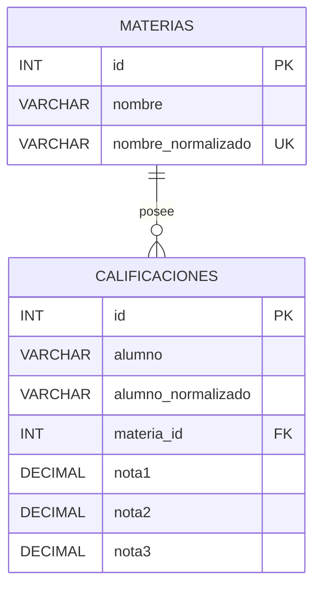

# Diagrama entidad-relación

```mermaid
erDiagram
    MATERIAS ||--o{ CALIFICACIONES : "posee"

    MATERIAS {
        INT id PK
        VARCHAR nombre
        VARCHAR nombre_normalizado UK
    }

    CALIFICACIONES {
        INT id PK
        VARCHAR alumno
        VARCHAR alumno_normalizado
        INT materia_id FK
        DECIMAL nota1
        DECIMAL nota2
        DECIMAL nota3
    }
```

La combinación `(alumno_normalizado, materia_id)` posee una restricción `UNIQUE`.
